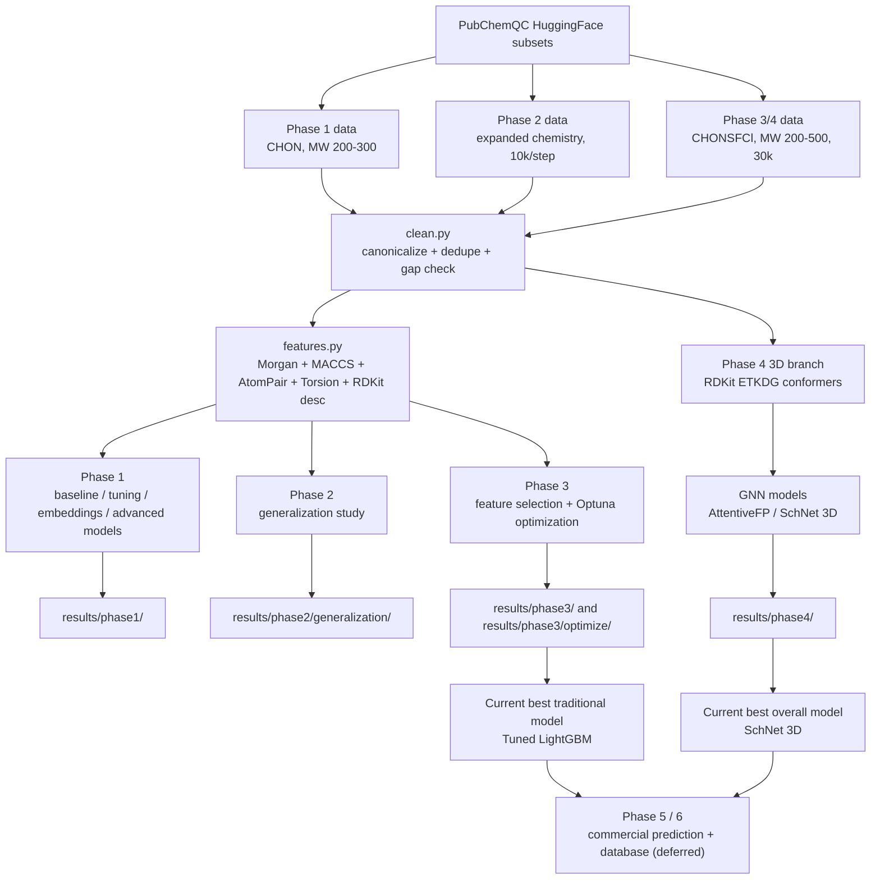
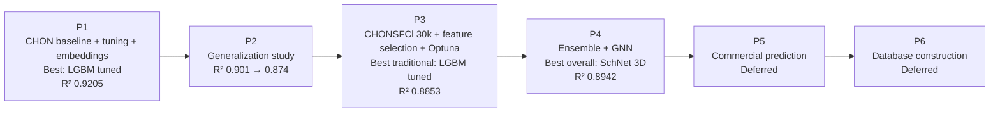

# MolGap Project Progress Visualization

## Last updated
2026-06-05

This page is a report-style visualization summary of the project up to the current point.

## 1. Master Data / Experiment Flow

## 2. Phase Roadmap

## 3. Phase Summary Table

| Phase | Main work | Data scope | Best result | Key conclusion |
|---|---|---|---|---|
| P1 | Baseline, tuning, embeddings, advanced models | 30k CHON, MW 200-300 | Tuned LightGBM, MAE 0.1498, R² 0.9205 | Traditional 2D features are very strong on easier chemistry |
| P2 | Generalization study | 10k per step, expanded chemistry | Step0 baseline R² 0.9012, step4 R² 0.8736 | Performance declines smoothly as chemistry broadens |
| P3 | CHONSFCl scale-up + feature selection + Optuna | 30k CHONSFCl, MW 200-500 | Tuned LightGBM, MAE 0.1596, R² 0.8853 | Better 2D fingerprints + feature selection help, but not enough to reach 0.9 |
| P4 | Ensemble + GNN | 30k CHONSFCl, MW 200-500 | SchNet 3D, MAE 0.1492, R² 0.8942 | 3D geometry is the first clear win over the best LightGBM |
| P5 | Commercial prediction | Application stage | Script ready | Deferred until model/report side is stable |

## 4. Chart Files

- `results/overview/phase2_generalization_curve.png`
- `results/overview/hard_task_progress.png`
- `results/overview/model_family_snapshot.png`
- `results/overview/phase_summary.csv`

## 5. Current headline messages

### If you want the best traditional model
- Use `Phase 3 tuned LightGBM`
- Best hard-task traditional result: `avg MAE=0.1596`, `avg R²=0.8853`

### If you want the best overall model
- Use `Phase 4 SchNet 3D`
- Best hard-task overall result: `avg MAE=0.1492`, `avg R²=0.8942`

### If you want the cleanest one-line conclusion
- The project has progressed from a strong 2D fingerprint baseline to a 3D GNN that closes most of the remaining gap to `R²=0.9` on the hardest current chemistry setting.
